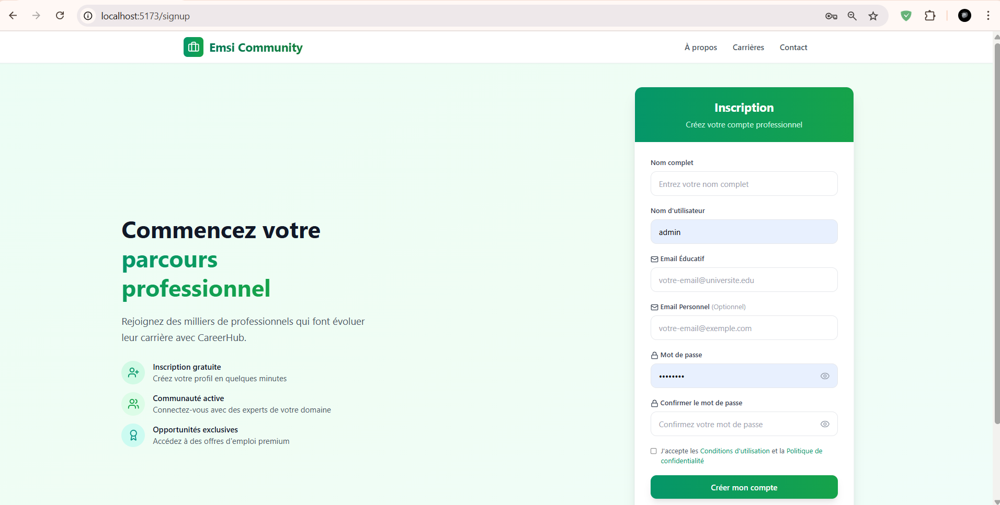
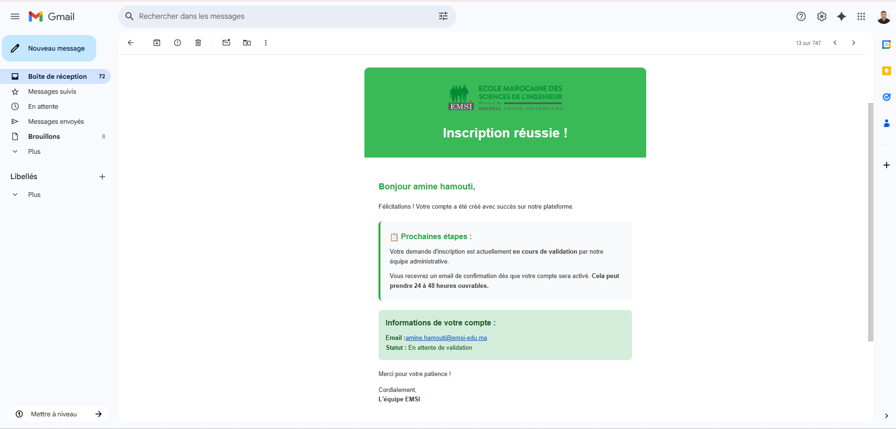
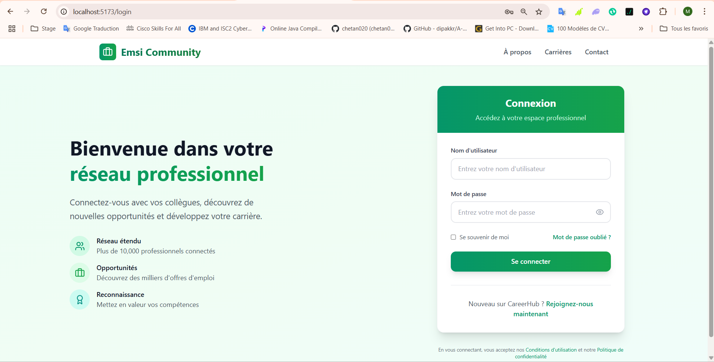
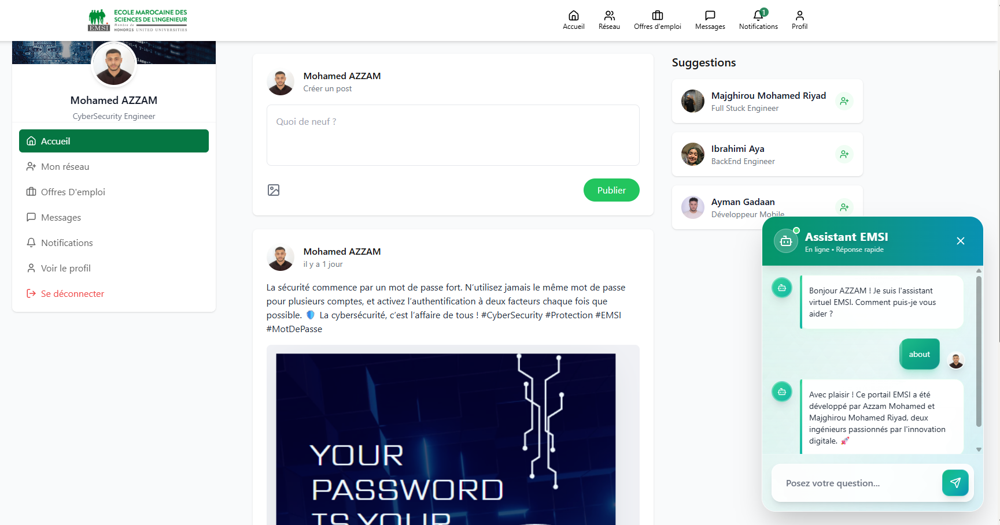
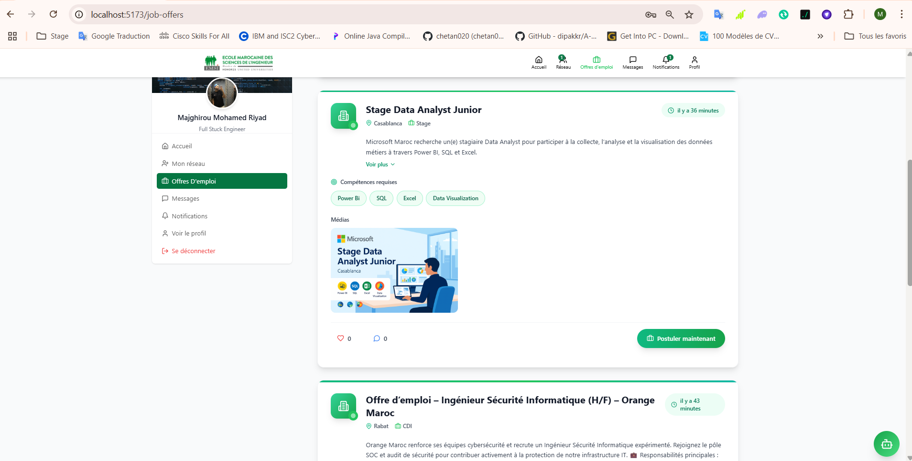
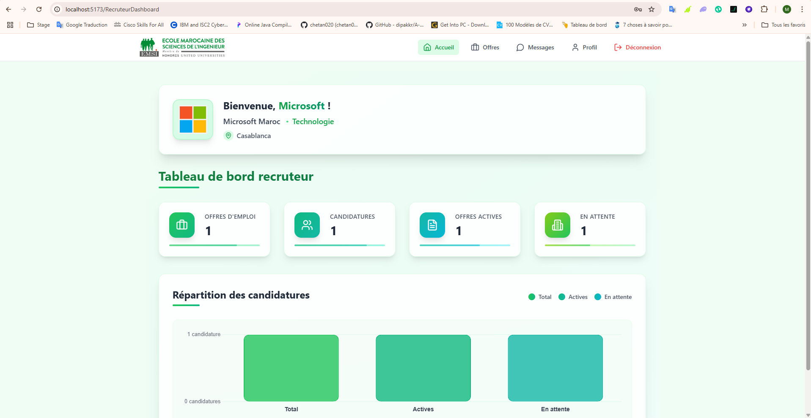
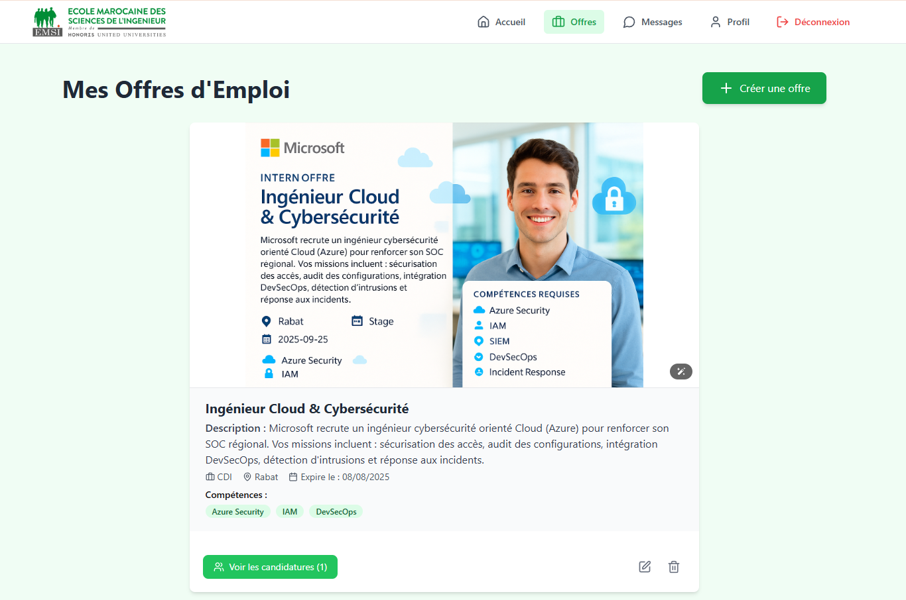
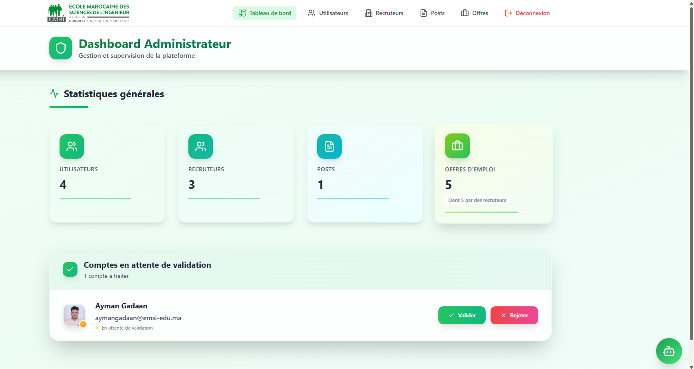
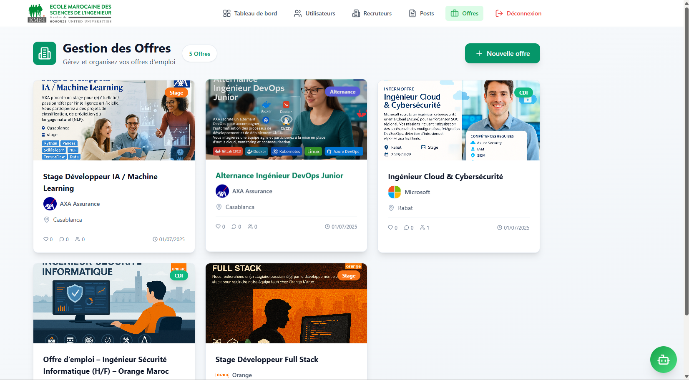

# Emsi Career - PFA 2024 - 2025

Ce projet est une application web complète inspirée de LinkedIn, permettant la gestion de profils, de publications, de connexions, de messagerie en temps réel, d'offres d'emploi, de notifications, et d'administration. Il est conçu pour un usage académique ou comme base pour un réseau social professionnel.

## 1. Technologies utilisées

### Backend :
- **Node.js** (runtime JavaScript)
- **Express.js** (framework serveur)
- **MongoDB** (base de données NoSQL, via Mongoose)
- **Socket.IO** (messagerie temps réel)
- **Nodemailer** (envoi d'e-mails)
- **Azure Blob Storage** (stockage d'images et de fichiers)
- **dotenv** (gestion des variables d'environnement)
- **CORS, cookie-parser, express-fileupload** (middlewares)
- **@azure/storage-blob** (SDK Azure)
- **bcrypt** (hachage des mots de passe)
 
### Frontend :
- **React** (bibliothèque UI)
- **Vite** (outil de build et dev server)
- **TailwindCSS** (framework CSS)
- **React Router** (navigation)
- **Axios** (requêtes HTTP)
- **Socket.IO Client** (temps réel)
- **React Query, Chart.js, DaisyUI, etc.**

## 2. Services et programmes externes
- **MongoDB Atlas** (ou instance locale)
- **Azure Blob Storage** (hébergement d'images et de fichiers)
- **SMTP (Gmail, Mailtrap, etc.)** pour l'envoi d'e-mails
- **Azure App Service** (hébergement du backend ou frontend)

## 3. Installation, configuration et commandes d'exécution (de A à Z)

### Prérequis
- Node.js >= 18.x
- npm >= 9.x
- Accès à une base MongoDB (Atlas ou locale)
- Un compte Azure avec un conteneur Blob Storage
- SMTP (Mailtrap, Gmail, etc.)

### 1. Cloner le dépôt
```bash
git clone <lien-du-repo>
cd linkedin-clone-master
```

### 2. Installer les dépendances
#### Backend :
```bash
cd backend
npm install
# Installer le SDK Azure si besoin :
npm install @azure/storage-blob mime-types
```
#### Frontend :
```bash
cd ../frontend
npm install
```

### 3. Configurer les variables d'environnement
Créez un fichier `.env` dans la racine avec le contenu suivant :

```env
# MongoDB
MONGO_URI=mongodb+srv://<user>:<password>@<cluster>.mongodb.net/<dbname>?retryWrites=true&w=majority

# URL du frontend (pour CORS)
CLIENT_URL=http://localhost:5173

# Azure Blob Storage
AZURE_STORAGE_CONNECTION_STRING=DefaultEndpointsProtocol=https;AccountName=xxxx;AccountKey=xxxx;EndpointSuffix=core.windows.net

# SMTP (Mailtrap, Gmail, etc.)
SMTP_EMAIL=xxxxxx
SMTP_PASS=xxxxxx

# (Optionnel) Port du serveur
PORT=5000

# (Optionnel) NODE_ENV=development
```

> **Remarque :** Ne partagez jamais ce fichier publiquement !

### 4. Lancer le backend
```bash
cd ../backend
npm run dev
```

### 5. Lancer le frontend
```bash
cd ../frontend
npm run dev
```

### 6. Scripts de création d'utilisateurs (optionnel)
Pour initialiser des comptes admin, recruteurs ou lauréats de test, exécutez les scripts suivants depuis le dossier `backend/script-users/` :
```bash
cd backend/script-users
node createAdmin.js
node createRecruteurs.js
node createLeaureat1.js
node createLeaureat2.js
node createLeaureat3.js
```

- Le backend sera accessible sur `http://localhost:5000`
- Le frontend sur `http://localhost:5173`

## 4. Fonctionnalités principales
- Authentification JWT (inscription, connexion)
- Gestion de profils utilisateurs (étudiants, recruteurs, admin)
- Publications, commentaires, likes
- Messagerie temps réel (Socket.IO)
- Offres d'emploi et candidatures
- Notifications en temps réel
- Tableau de bord administrateur
- Upload d'images et de fichiers (Azure Blob Storage)
- Envoi d'e-mails (SMTP)

## 5. Conseils et dépannage
- Vérifiez que toutes les variables d'environnement sont bien renseignées.
- Pour MongoDB Atlas, autorisez votre IP dans le dashboard.
- Pour Azure Blob Storage, créez un conteneur et récupérez la chaîne de connexion dans le portail Azure.
- Pour SMTP, créez des comptes gratuits si besoin.
- En cas de problème de CORS, vérifiez la variable `CLIENT_URL`.

## 6. Acteurs de l'application et leurs fonctionnalités

### 1. 👩‍🎓 Utilisateur (Lauréat)
- Créer et gérer son profil (informations, expérience, éducation, compétences, CV)
- Publier, commenter, aimer des posts
- Envoyer et accepter des demandes de connexion
- Postuler à des offres d'emploi
- Messagerie temps réel avec d'autres utilisateurs
- Recevoir des notifications (nouvelle offre, message, etc.)

### 2. 🏢  Recruteur
- Créer et gérer des offres d'emploi
- Gérer les candidatures reçues (accepter, refuser)
- Consulter les profils des candidats
- Messagerie temps réel avec les candidats
- Statistiques sur les offres et candidatures

### 3. 🛡️ Administrateur
- Valider ou rejeter les nouveaux comptes utilisateurs
- Gérer tous les utilisateurs (modification, suppression)
- Gérer tous les posts (modification, suppression)
- Accéder à des statistiques globales
- Recevoir des notifications administratives

## 7. Scripts de création d'utilisateurs (backend/script-users)

Le dossier `backend/script-users/` contient des scripts pour initialiser rapidement des comptes dans la base de données :

- **createAdmin.js** : Crée un compte administrateur avec les informations passées en argument ou par défaut (nom, email, username, mot de passe).
- **createRecruteurs.js** : Crée plusieurs comptes recruteur (entreprises) avec leurs informations, logo, secteur, etc.
- **createLeaureat1.js** : Crée un compte lauréat (étudiant diplômé) avec des données de test (profil, CV, réseaux sociaux, etc.).
- **createLeaureat2.js** : Crée un autre compte lauréat avec des données différentes.
- **createLeaureat3.js** : Crée un troisième compte lauréat avec des données différentes.

## 8. 📸 Aperçu visuel de la plateforme

### 📝 Page d’inscription
> Interface claire pour créer un compte lauréat, recruteur ou administrateur.


---

### 📧 Email de confirmation
> Email automatique envoyé après inscription avec message de validation.


---
### 🔐 Page de connexion
> Interface sécurisée pour se connecter avec vérification des rôles et gestion des erreurs.

---
### 👤 Profil lauréat validé
> Exemple de profil complet avec informations, expériences et réseaux.


---
### 💬 Assistant virtuel EMSI (Chatbot)
> Chatbot intelligent intégré à la plateforme pour guider les utilisateurs en temps réel. Il fournit des réponses rapides, des messages de bienvenue, des informations sur la plateforme, et renforce l’aspect interactif du portail.


---

### 💼 Offres d’emploi – Côté Lauréat
> Liste des offres disponibles avec compétences requises et option de postulation directe.


---
### 📊 Tableau de bord Recruteur
> Statistiques et répartition des candidatures reçues.


---

### 🧩 Gestion des offres – Côté Recruteur
> Interface intuitive pour ajouter, modifier et gérer ses offres d’emploi.


---

### 🛡️ Dashboard Administrateur
> Vue centralisée de supervision : utilisateurs, recruteurs, offres et validation des comptes.


---

### 🗃️ Gestion des Offres – Côté Administrateur
> Liste complète des offres créées par les recruteurs avec filtres et actions.


---

## 9. 👥 Contributeurs

### 🧠 Mohamed Azzam  
**Développeur Backend**  
- 🔗 Intégration de la base de données  
- 🔐 Sécurisation des routes API  
- ☁️ Déploiement sur Azure & gestion du stockage cloud  
- 🧰 GitHub : [@azzammoo10](https://github.com/azzammoo10)


### 🎨 Majhirou Mohamed Riyad  
**Développeur Frontend**  
- 🖌️ Conception de l’interface utilisateur avec React & Tailwind  
- 💡 Expérience utilisateur (UI/UX)  
- ⚙️ Intégration des pages dynamiques  
- 🧰 GitHub : [@riyad4589](https://github.com/riyad4589)


---

## Documentation

[📄 Télécharger le rapport complet (PDF)](https://www.mediafire.com/file/gy4lhy72yztola3/Rapport_PFA_Majghirou_Mohamed_Riyad_-_Mohamed_Azzam.pdf/file)

**Projet réalisé par MAJGHIROU Mohamed Riyad et AZZAM Mohamed dans un but pédagogique.** 
